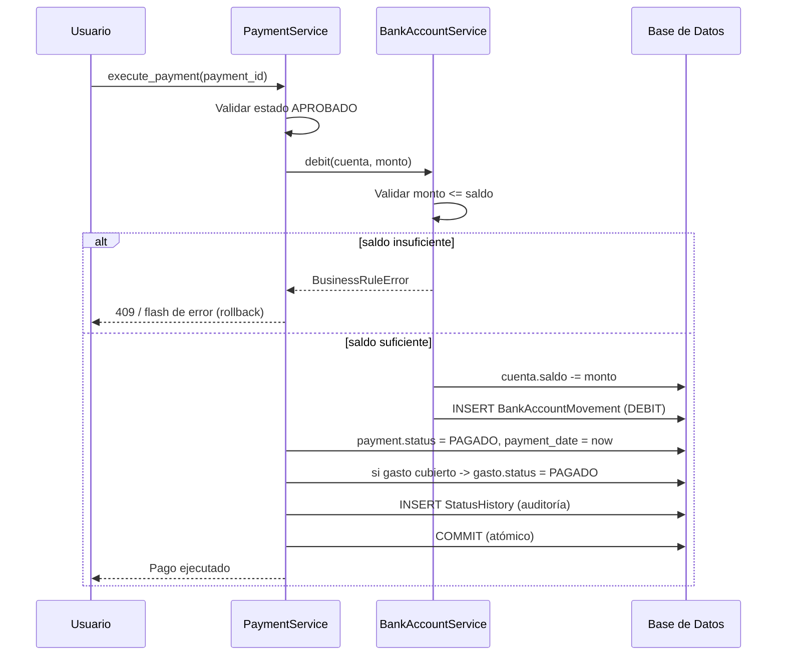

# Diseño Funcional

Este documento describe los flujos de negocio del sistema mediante diagramas
Mermaid. Reflejan exactamente las máquinas de estado implementadas en la capa
de servicios (`services/expense_service.py` y `services/payment_service.py`).

---

## 1. Flujo de Gastos

```mermaid
flowchart TD
    Start([Inicio]) --> Create[Crear Gasto]
    Create --> Pending[/Estado: PENDIENTE/]

    Pending -->|Aprobar| Approved[/Estado: APROBADO/]
    Pending -->|Cancelar| Cancelled[/Estado: CANCELADO/]

    Approved -->|Generar Pago| GenPay{¿Saldo pendiente<br/>del gasto > 0?}
    GenPay -->|Sí| Payment[[Crear Pago - ver flujo de pagos]]
    GenPay -->|No| Blocked[/Bloqueado:<br/>gasto ya cubierto/]

    Approved -->|Pago(s) cubren el total| Paid[/Estado: PAGADO/]
    Approved -->|Cancelar - sin pagos activos| Cancelled

    Paid -->|Se revierte un pago ejecutado| Approved

    Cancelled --> End([Terminal: no se reactiva])

    classDef terminal fill:#6c757d,color:#fff;
    classDef paid fill:#198754,color:#fff;
    class Cancelled terminal
    class Paid paid
```

### Restricciones de negocio (Gastos)

| Regla | Implementación |
|-------|----------------|
| Un gasto inicia en **PENDIENTE** | `ExpenseService.create_expense` |
| Solo **PENDIENTE → APROBADO** | tabla `_ALLOWED_TRANSITIONS` |
| **PENDIENTE/APROBADO → CANCELADO** | `cancel_expense` (valida que no existan pagos activos) |
| Un gasto **CANCELADO nunca se reactiva** | estado terminal (conjunto de transiciones vacío) |
| Solo un gasto **APROBADO** genera pagos | `PaymentService.generate_payment` valida el estado |
| El monto debe ser **> 0** | `_validate_amount` |
| **APROBADO → PAGADO** automático cuando se cubre el total | `mark_paid_if_settled` |

---

## 2. Flujo de Pagos

```mermaid
flowchart TD
    Origin[Gasto APROBADO] -->|Botón "Generar Pago"| Validate{Validaciones}
    Validate -->|monto <= saldo pendiente<br/>cuenta activa| Pending[/Estado: PENDIENTE/]
    Validate -->|monto > pendiente<br/>o gasto ya cubierto| Reject[/Rechazado:<br/>evita pago duplicado/]

    Pending -->|Aprobar| Approved[/Estado: APROBADO/]
    Pending -->|Cancelar| Cancelled[/Estado: CANCELADO/]

    Approved -->|Marcar como Pagado| CheckBalance{¿monto <= saldo<br/>de la cuenta?}
    CheckBalance -->|No| RejectBal[/Rechazado:<br/>saldo insuficiente/]
    CheckBalance -->|Sí| Execute[Ejecutar pago]

    Execute --> Debit[(Débito a cuenta<br/>+ movimiento en ledger)]
    Debit --> Paid[/Estado: PAGADO/]
    Paid --> Settle{¿Gasto totalmente<br/>cubierto?}
    Settle -->|Sí| ExpensePaid[Gasto → PAGADO]

    Approved -->|Cancelar| Cancelled
    Paid -->|Cancelar = Reversa| Reverse[(Crédito a cuenta<br/>+ reabrir gasto)]
    Reverse --> Cancelled

    Cancelled --> End([Terminal])

    classDef terminal fill:#6c757d,color:#fff;
    classDef paid fill:#198754,color:#fff;
    class Cancelled terminal
    class Paid,ExpensePaid paid
```

### Restricciones de negocio (Pagos)

| Regla | Implementación |
|-------|----------------|
| Se originan **solo desde un gasto APROBADO** | `generate_payment` valida `expense.status` |
| Botón **"Generar Pago"** | ruta `payments.generate` + `generate_payment` |
| **Pagos parciales** soportados | varios pagos por gasto; se controla el `remaining_amount` |
| **Evitar pagos duplicados / sobrepago** | `Σ(pagos no cancelados) ≤ monto del gasto` |
| Pueden **aprobarse / cancelarse / marcarse pagados** | máquina de estados de pagos |
| Un pago **no puede exceder el saldo** | `BankAccountService.debit` valida saldo |
| Al **ejecutar** disminuye el saldo | `debit` + `BankAccountMovement` |
| **Historial de movimientos** | tabla `bank_account_movements` (ledger inmutable) |
| Cancelar un pago **PAGADO** revierte el saldo | `cancel_payment` emite un `CREDIT` y reabre el gasto |

---

## 3. Impacto en cuentas bancarias



Toda la operación de ejecución ocurre dentro de **una sola transacción**: si
cualquier paso falla, el manejador de errores (`middleware/error_handlers.py`)
hace `rollback` y nada queda aplicado a medias.
