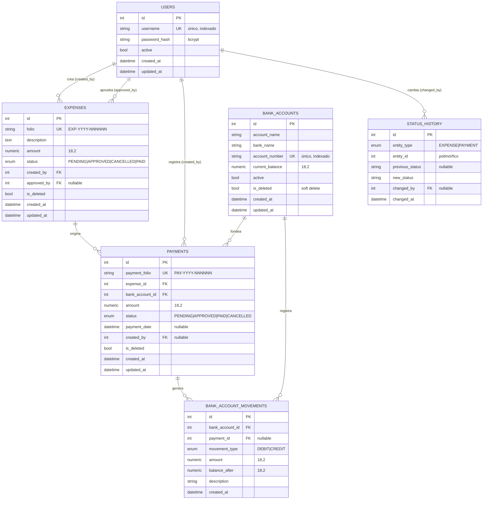

# Diseño de Base de Datos

Modelo relacional del sistema. Todas las cantidades monetarias usan
`NUMERIC(18,2)` (no `float`) para evitar errores de redondeo.

---

## Diagrama Entidad-Relación



---

## Cardinalidades

| Relación | Cardinalidad | Descripción |
|----------|--------------|-------------|
| Usuario → Gastos | 1 : N | Un usuario crea/aprueba muchos gastos |
| Gasto → Pagos | 1 : N | Un gasto puede tener varios pagos (parciales) |
| Cuenta → Pagos | 1 : N | Una cuenta fondea muchos pagos |
| Cuenta → Movimientos | 1 : N | Una cuenta tiene muchos movimientos en su ledger |
| Pago → Movimientos | 1 : N | Un pago genera un débito (y un crédito si se revierte) |
| (Gasto/Pago) → Historial | 1 : N | Cada entidad acumula su historial de estados |

---

## Llaves primarias y foráneas

**Llaves primarias:** todas las tablas usan `id` (entero autoincremental).

**Llaves foráneas:**

| Tabla | Columna | Referencia | Borrado |
|-------|---------|------------|---------|
| `expenses` | `created_by` | `users.id` | RESTRICT |
| `expenses` | `approved_by` | `users.id` | RESTRICT (nullable) |
| `payments` | `expense_id` | `expenses.id` | RESTRICT |
| `payments` | `bank_account_id` | `bank_accounts.id` | RESTRICT |
| `payments` | `created_by` | `users.id` | RESTRICT (nullable) |
| `bank_account_movements` | `bank_account_id` | `bank_accounts.id` | RESTRICT |
| `bank_account_movements` | `payment_id` | `payments.id` | RESTRICT (nullable) |
| `status_history` | `changed_by` | `users.id` | RESTRICT (nullable) |

> Se prefiere `RESTRICT` sobre `CASCADE`: los registros financieros y de
> auditoría nunca deben borrarse en cascada. La eliminación lógica
> (`is_deleted`) cubre los casos de "baja" sin perder trazabilidad.

---

## Índices recomendados

Definidos en los modelos (`index=True` / `unique=True`):

| Tabla | Índice | Motivo |
|-------|--------|--------|
| `users` | `username` (único) | Login y unicidad |
| `bank_accounts` | `account_number` (único) | Búsqueda y unicidad |
| `bank_accounts` | `is_deleted` | Filtrado de soft-delete |
| `expenses` | `folio` (único) | Búsqueda por folio |
| `expenses` | `status` | Filtros de listado y dashboard |
| `expenses` | `created_by`, `is_deleted` | Joins y filtrado |
| `payments` | `payment_folio` (único) | Búsqueda por folio |
| `payments` | `status` | Filtros y KPIs |
| `payments` | `expense_id`, `bank_account_id` | Joins frecuentes |
| `bank_account_movements` | `bank_account_id`, `payment_id`, `created_at` | Ledger por cuenta y orden cronológico |
| `status_history` | `entity_type`, `entity_id`, `changed_at` | Recuperar auditoría por entidad |

### Índice compuesto sugerido (producción a escala)

Para la consulta de auditoría más común (historial de una entidad concreta en
orden cronológico) conviene un índice compuesto:

```sql
CREATE INDEX ix_status_history_entity
    ON status_history (entity_type, entity_id, changed_at);
```

Y para listar movimientos de una cuenta por fecha:

```sql
CREATE INDEX ix_movements_account_date
    ON bank_account_movements (bank_account_id, created_at DESC);
```
